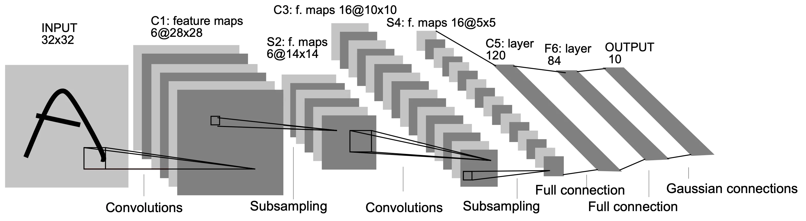
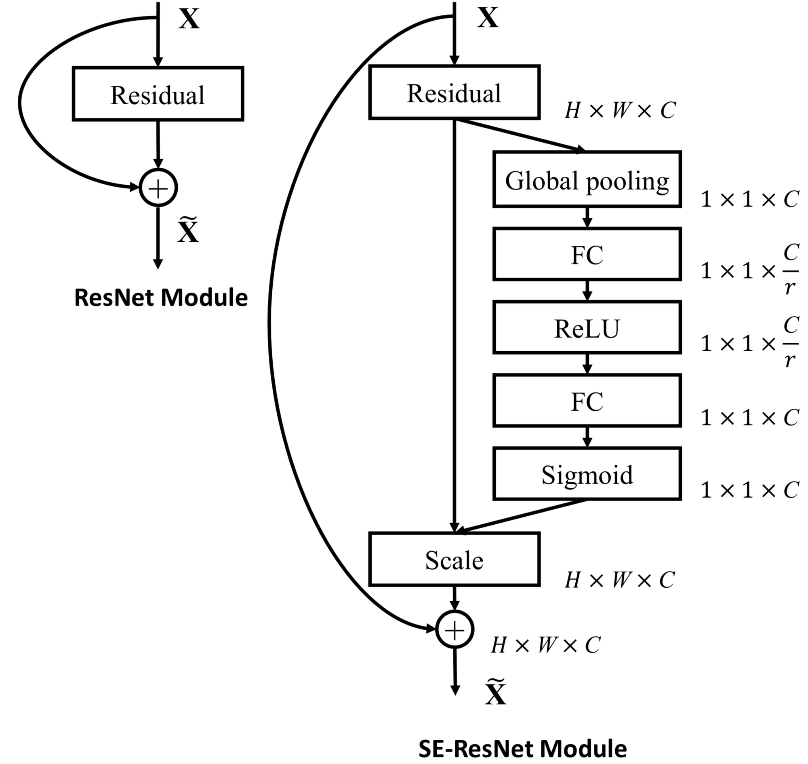

# CNN Architectures That Shaped Modern Computer Vision

A hands-on reconstruction of the convolutional neural network architectures that defined the ImageNet era — studied not as isolated models, but as a **chain of architectural ideas**.

This repository accompanies a single, deeply annotated notebook where classic CNNs are implemented from scratch to answer one question:

> *Why did each architecture need to exist?*

---

## Motivation

Modern CNNs weren’t born fully formed.  
They evolved through a sequence of sharp architectural insights, each reacting to a specific failure of the previous generation:

- shallow networks failing to generalize  
- optimization breaking as depth increased  
- exploding parameter counts  
- inefficient feature extraction  
- lack of channel-level awareness  

This project revisits those moments by **rebuilding the original architectures**, layer by layer, to expose the ideas that still shape computer vision today.

---

## Architectures Reimplemented

### LeNet-5 — The Proof of Concept
The original demonstration that convolution, pooling, and weight sharing work.

  

---

### AlexNet — Scale Changes Everything
Deep networks, ReLU, dropout, and GPUs enter the picture.

  

---

### VGGNet — Depth as a Design Principle
Uniform 3×3 convolutions stacked deep, proving representation power grows with depth.

  

---

### GoogLeNet — Multi-Scale Thinking
Inception modules allow multiple receptive fields to coexist efficiently.

  

---

### ResNet — Learning Residuals
Skip connections solve the degradation problem and unlock very deep networks.

  

---

### SENet — Channel-Wise Attention
Not *where* features are, but *which* features matter.

  

---

### Xception — Extreme Factorization
Depthwise separable convolutions fully separate spatial and channel learning.

  

---

## What the Notebook Contains

- Manual implementations using TensorFlow / Keras primitives  
- Custom building blocks (Inception, residual blocks, SE blocks, separable convolutions)  
- Architectural diagrams aligned with code  
- Explanations focused on **design intent**, not API usage  
- A concluding synthesis connecting all models into one evolutionary narrative  

No pre-trained weights. No training benchmarks. No black boxes.

---

## Core Architectural Insights

Across all architectures, a pattern emerges:

- **LeNet →** convolution works  
- **AlexNet →** scale + nonlinearity matter  
- **VGG →** depth improves representation  
- **GoogLeNet →** multi-scale processing matters  
- **ResNet →** optimization limits depth, not capacity  
- **SENet →** channel relationships matter  
- **Xception →** spatial and channel correlations can be separated  

These ideas don’t replace one another — they **accumulate**.

---

## What’s Intentionally Not Included

Architectures such as EfficientNet, DenseNet, ConvNeXt, ResNeXt, and Inception-v4 are omitted deliberately.

This notebook focuses on **foundational ideas**, not exhaustive coverage.  
Adding everything would dilute the signal.

---

## Notebook

📓 **Main notebook:** [ilsvrc-winner-cnn-architectures-with-keras](./ilsvrc-winner-cnn-architectures-with-keras.ipynb)

---

## References

LeCun et al. (1998)  
Krizhevsky et al. (2012)  
Simonyan & Zisserman (2014)  
Szegedy et al. (2015)  
He et al. (2015)  
Hu et al. (2018)  
Chollet (2016)
